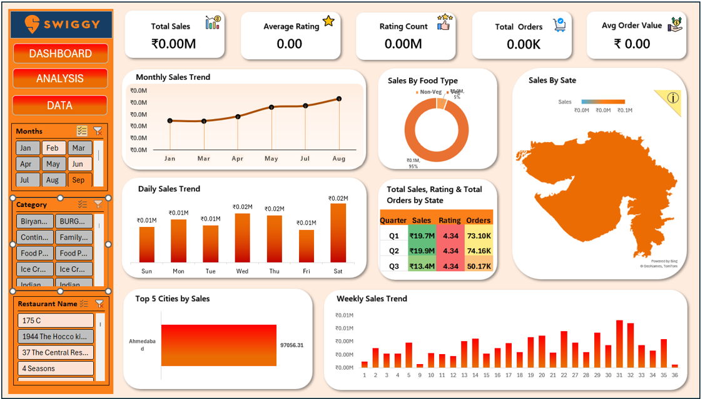

# 🍔 Swiggy Sales Dashboard
## 🚀 Overview
This project presents an interactive Sales Dashboard built using Advanced Excel.
It transforms raw Swiggy data into meaningful insights to analyze sales performance, customer behavior, and business trends.

🎯 Problem Statement
In the food delivery industry, analyzing large datasets is essential to:

Identify revenue-driving factors

Understand customer preferences

Improve business performance

 ## 💡 Solution
Developed a dynamic Excel dashboard that:

Cleans and structures raw data

Uses Pivot Tables for aggregation

Applies slicers for interactivity

Visualizes insights through charts

## 🛠️ Tools & Techniques

Microsoft Excel (Advanced)

Pivot Tables & Pivot Charts

Slicers & Filters

Conditional Formatting

Excel Functions:

SUMIFS, COUNTIFS

IF, IFERROR

XLOOKUP

## 📊 Key KPIs

Total Sales 💰

Total Orders 📦

Average Order Value (AOV) 📈

Customer Ratings ⭐

City-wise Sales 🌍

## 📈 Dashboard Features

Interactive slicers (City, Category, Date)

Sales trend analysis (monthly/yearly)

Top-performing cities and categories

Customer rating distribution

Revenue insights

## 🔍 Key Insights

Sales are higher on weekends 📅

Top cities generate most revenue 🌆

Higher ratings lead to more orders ⭐

Evening time has peak orders 🌙

Combo offers increase order value 📦

## 📸 Dashboard Preview

  

